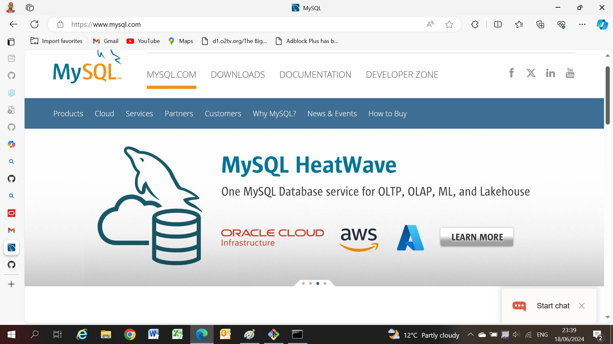

# Dev_Setup
Setup Development Environment

#Assignment: Setting Up Your Developer Environment

#Objective:
This assignment aims to familiarize you with the tools and configurations necessary to set up an efficient developer environment for software engineering projects. Completing this assignment will give you the skills required to set up a robust and productive workspace conducive to coding, debugging, version control, and collaboration.

#Tasks:

1. Select Your Operating System (OS):
   Choose an operating system that best suits your preferences and project requirements. Download and Install Windows 11. https://www.microsoft.com/software-download/windows11

Answer

2. Install a Text Editor or Integrated Development Environment (IDE):
   Select and install a text editor or IDE suitable for your programming languages and workflow. Download and Install Visual Studio Code. https://code.visualstudio.com/Download

Answer

3. Set Up Version Control System:
   Install Git and configure it on your local machine. Create a GitHub account for hosting your repositories. Initialize a Git repository for your project and make your first commit. https://github.com

Answer

 

4. Install Necessary Programming Languages and Runtimes:
  Instal Python from http://wwww.python.org programming language required for your project and install their respective compilers, interpreters, or runtimes. Ensure you have the necessary tools to build and execute your code.

  Answer

  

5. Install Package Managers:
   If applicable, install package managers like pip (Python).

   Answer

   

6. Configure a Database (MySQL):
   Download and install MySQL database. https://dev.mysql.com/downloads/windows/installer/5.7.html

   Answer

    

   Setup documentation

   To be honest i have already had most of the Softwares recommended except for mysql, in 2023 i learned python and visual studio code through youtube which is how i came to install most of the softwares. Below are the steps taken

   Setting Up My Developer Environment

Step 1: Install the Operating System
I installed Windows 10 as my primary operating system.

Step 2: Install Visual Studio Code
I downloaded and installed Visual Studio Code which is my preferred code editor due to its versatility and the availability of numerous extensions.

Step 3: Install Git
I installed Git for version control. This allows me to track changes in my code and collaborate with other developers.

Step 4: Set Up Git
After installing Git, I set up my user name and email address which are used in the commit messages.
git config --global user.name "Katlego Molatudi"
git config --global user.email "ksmolatudi@gmail.com"

Step 5: Install Node.js and npm
I installed Node.js which also includes npm (node package manager). This allows me to run JavaScript code on my machine and manage project dependencies.

Step 6: Install Visual Studio Code Extensions
I installed several VS Code extensions that aid in development. Some of these include:
•	ESLint: This tool helps in identifying and reporting on patterns found in ECMAScript/JavaScript code.
•	Prettier: An opinionated code formatter that enforces a consistent style by parsing your code and reprinting it.

Step 7: Customize Visual Studio Code
I customized my VS Code settings to fit my coding style.
Troubleshooting Steps

During the setup, I encountered an issue where Git commands were not recognized in the VS Code terminal. I resolved this by adding Git to my system’s PATH in the Environment Variables settings.

7. Set Up Development Environments and Virtualization (Optional):
   Consider using virtualization tools like Docker or virtual machines to isolate project dependencies and ensure consistent environments across different machines.

8. Explore Extensions and Plugins:
   Explore available extensions, plugins, and add-ons for your chosen text editor or IDE to enhance functionality, such as syntax highlighting, linting, code formatting, and version control integration.

9. Document Your Setup:
    Create a comprehensive document outlining the steps you've taken to set up your developer environment. Include any configurations, customizations, or troubleshooting steps encountered during the process. 

#Deliverables:
- Document detailing the setup process with step-by-step instructions and screenshots where necessary.
- A GitHub repository containing a sample project initialized with Git and any necessary configuration files (e.g., .gitignore).
- A reflection on the challenges faced during setup and strategies employed to overcome them.

#Submission:
Submit your document and GitHub repository link through the designated platform or email to the instructor by the specified deadline.

#Evaluation Criteria:**
- Completeness and accuracy of setup documentation.
- Effectiveness of version control implementation.
- Appropriateness of tools selected for the project requirements.
- Clarity of reflection on challenges and solutions encountered.
- Adherence to submission guidelines and deadlines.

Note: Feel free to reach out for clarification or assistance with any aspect of the assignment.
